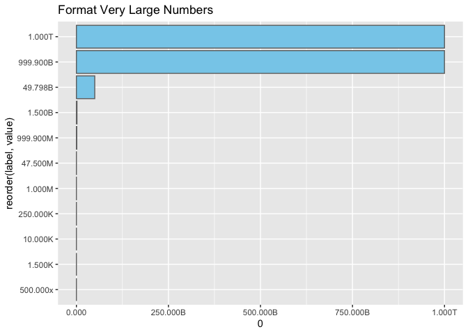

# Format Large Number Function

A lightweight utility function for formatting large numeric values with
SI-style suffixes—perfect for dashboards, data visualizations, and Shiny
apps that need to display numbers like 49,798,087,000 as “49.798B”.

## 📌 Why this?

While the {scales} package offers powerful label formatting via
`label_number()`, its default `scale_cut` behavior:

- Doesn’t include in tens of “B” for billions
- May drop precision or switch to “M” for values just under 1e10
- Requires a custom setup to support trillions and more readable
  large-number formatting

This utility fills that gap with:

- Custom-defined cutpoints for “K”, “M”, “B”, and “T”
- Compatibility with `mutate()` and `scale_y_continuous(labels = ...)`
- User-defined precision—defaulting to `accuracy = 0.001` for values
  like “49.798B”, but fully customizable

## ✨ Features

- Formats numeric values from the hundreds up to trillions (and beyond
  if extended)
- Defaults to 3-decimal precision for billions, but accuracy is fully
  user-configurable
- Works in pipelines with `dplyr::mutate()` or `ggplot2` labels
- Designed for clarity—“B” for billions, not “G”; “T” for trillions, not
  scientific notation

## 📦 Installation

This is a standalone utility script. To use it:

1.  Copy `format_large_numbers()` from `format_large_numbers.R`, or

2.  Source it directly from GitHub:

    source(“<https://raw.githubusercontent.com/abiyug/formatLargeNumbers/main/format_large_numbers.R>”)

## 🔧 Usage

    format_large_numbers(c(1500, 2.5e6, 49.798e9))
    #> [1] "1.5K"   "2.5M"   "49.798B"

Specify accuracy as needed:

    format_large_numbers(1e9, accuracy = 1)
    #> [1] "1B"

## 🧪 Test It Yourself

Sample test data is included in `test.R`:

``` r
source("https://raw.githubusercontent.com/abiyug/formatLargeNumbers/main/format_large_numbers.R")

library(dplyr)
```

    ## 
    ## Attaching package: 'dplyr'

    ## The following objects are masked from 'package:stats':
    ## 
    ##     filter, lag

    ## The following objects are masked from 'package:base':
    ## 
    ##     intersect, setdiff, setequal, union

``` r
    df_test <- 
  tibble::tibble(
      value = c(500, 1500, 1e4, 2.5e5, 1e6, 4.75e7, 9.999e8, 1.5e9, 49.798087e9, 9.999e11, 1e12)
    )

df_test_2 <-
    df_test %>% 
      mutate(label = format_large_numbers(value))

df_test_2
```

    ## # A tibble: 11 × 2
    ##            value label   
    ##            <dbl> <chr>   
    ##  1           500 500.000x
    ##  2          1500 1.500K  
    ##  3         10000 10.000K 
    ##  4        250000 250.000K
    ##  5       1000000 1.000M  
    ##  6      47500000 47.500M 
    ##  7     999900000 999.900M
    ##  8    1500000000 1.500B  
    ##  9   49798087000 49.798B 
    ## 10  999900000000 999.900B
    ## 11 1000000000000 1.000T

## 📊 Works with ggplot2

This formatter plugs seamlessly into ggplot2 via
scale\_\*\_continuous(labels = format_large_numbers). Take a look at the
Y axis: large values like 49.8 billion or 1 trillion are labeled clearly
and consistently—no scientific notation, no surprises. You also retain
full control over rounding with the accuracy parameter, letting you dial
in precision that suits your story.

``` r
library(ggplot2)

ggplot(df_test_2, aes(x = value, y = reorder(label,value))) +
      geom_col(fill = "skyblue", color = "gray44") +
      scale_x_continuous(expansion(mult = c(0, 0)),
        labels = format_large_numbers) +
      labs(title = "Format Very Large Numbers")
```

<!-- -->
\## 🔍 Behind the Scenes

Built on top of `scales::label_number()`, this function uses a named
numeric vector as a custom `scale_cut`. The cutpoints are:

- “K” = 1e3
- “M” = 1e6
- “B” = 1e9
- “T” = 1e12

…and defaults to `accuracy = 0.001` (e.g., “49.798B”), but you can set
this to match your preferred rounding style.

## 🤝 Contributing

Found a bug, want to suggest suffixes for Q (quadrillion) or P (peta)?
PRs welcome. Or tag @abiyug on <X/@datarecode> with plots powered by
this formatter.

------------------------------------------------------------------------

This formatter was handcrafted for precision, readability, and
presentation clarity. Happy plotting!
